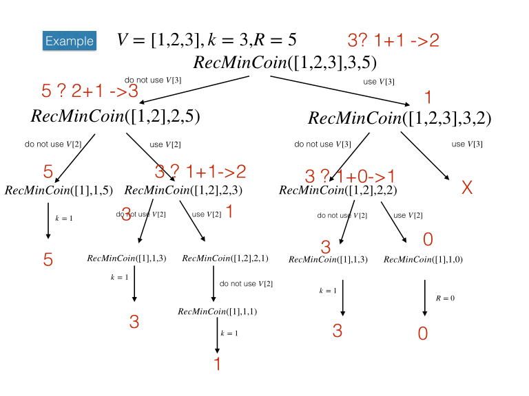
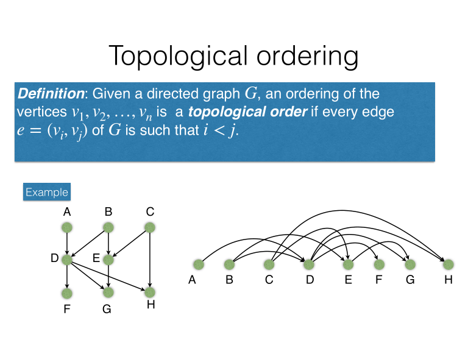
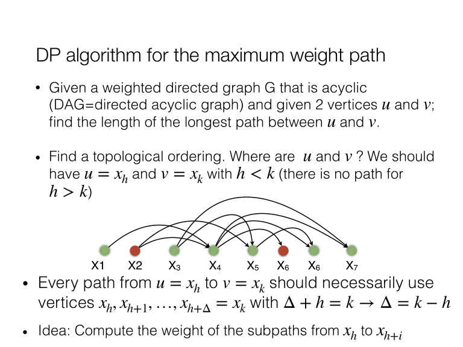
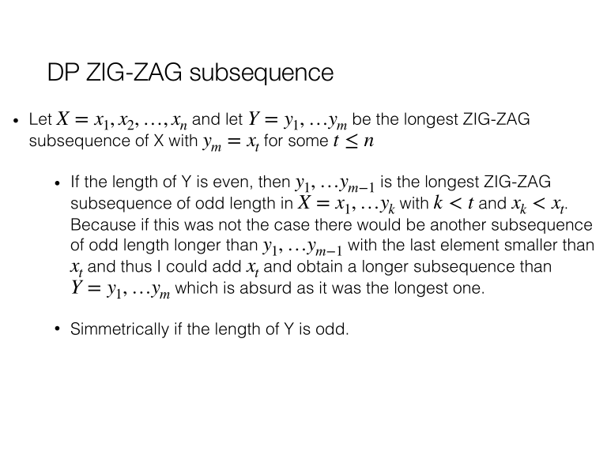
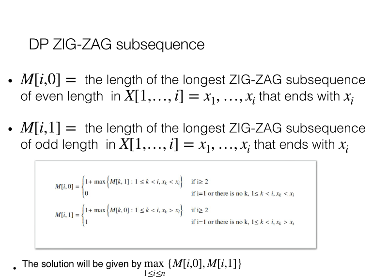

# Dynamic programming

## Definition

This is a method in which we store previously calculated values
so that we may easily retrieve them again
without having to recalculate.

Problems are subdivided into simpler subproblems,
and solutions are evaluated exhaustively.
It is an interative bottom-up approach.

The most important part is identifying a recurrence,
after which implementation is trivial.

## Minimum (number of) coin change problem

Minimizing the number of coins returnsed
for a particular quantity of change,
with available coins {c₁,…,c_k}.

There can be multiple solutions,
or no solution, depending on the coinage
and amount due.

### Greedy algorithm

	R ← return amount
	SOL ← ∅
	i ← 1
	ORDER coins in decreasing order: {c₁,…,c_k}
	while R > 0 and i ≤ k
		if R ≥ cᵢ
			R ← R - cᵢ
			SOL ← SOL + 1
		else
			i ← i + 1
	if R > 0
		print nope
	else
		return SOL

#### Optimality and correctness

	R=6, C=4,3,1: SOL=4+1+1, SOL∗=3+3
	R=6, C=5,2: SOL=5→fail SOL∗=2+2+2

It is neither correct nor optimal.

### Recursive algorithm

We assume all coins have infinite availability.

	// R ← change
	// V ← vector of k available coins with V[1] = 1
	min ← fun(R, V, k)
		if R = 0
			return 0
		else if k = 1		// only 1-coin
			return R
		// we don't use V[k]
		min ← foo(R, V, k-1)
		// we do use V[k] as many times as we can
		if R ≥ V[k]		// but can we even
			m ← 1 + foo(R - V[k], V, k)
			if m < min	// but did we exceed minimum
				min ← m
		return min

#### Example

#### Correctness and optimality

Supposing we have infinite time,
this will always return the best,
or at least one of the best solutions.

However, it is an exhaustive search of all possible cases.
In addition, there are many branches where k=1
and the algorithm repeats
(why? if k=1 we return immediately).

### Dynamic programming algorithm

	M ← matrix of size k * (R+1)	// k rows * R columns
	V ← vector of coinage 1…k
	for r=0 to R			// possible remaining change
		M[1,r] ← r
	for i=1 to k			// possible min coins
		M[i,0] ← 0
	// skip initialized (k[1,] and R[,0])
	for i=2 to k			// for every k row
		for r=*2* to R*+1*		// for every R column
			M[i,r] ← M[i-1,r]	// reuse previous min
			if r ≥ V[i] and 1 + M[i,r-V[i]] < M[i,r]	// we can do better with k
				M[i,r] ← 1 + M[i, r-V[i]]		// with a previous R

	M:
	     0  1  2 …  R
	-----------------
	1 |  0  1  2 …  R
	2 |  0
	3 |  0
	
	M[k,R] =
		V[k] > R
		? M[k-1,R]
		: min(M[k-1,R], 1+M[k,R-V[k]])

The minimum is propagated all the way to M[k,R+1]
(because there are R+1 columns):
SOL = M[k,R+1].

I changed R loop to 2→R+1 instead of 1→R
otherwise M[,R+1] will never be updated,
and M[,1] overwritten.

#### Complexity

Necessarily always k·(R+1) operations:
O(k·R).

## Knapsack problem

We have a bag of capacity C
and n objects with weights w₁,…,w_₏,
and values v₁,…,v₏.

Find a subset S of objects
which can enter in the bag, ie. Σwᵢ ≤ C
and have maximum value max(Σvᵢ).

### Greedy solution 1

At each iteration,
choose among the objects the one of greatest value
that can still be added.

This again does not give an optimal solution.

	C = 20
	w₁ = 10, v₁ = 15
	w₂ = 8, v₂ = 20
	w₃ = 20, v₃ = 28

	SOL = 28 via o₃
	but SOL∗ = 35 via o₂+o₁.

### Greedy solution 2

Like before, choose largest value,
but also largest remaining space (weight).
Let's say qᵢ = vᵢ/wᵢ,
we choose an object with wᵢ<C and max qᵢ.

	C = 20

	w₁ = 10, v₁ = 15, q₁ = 1.5
	w₂ = 8, v₂ = 20, q₂ = 2.5
	w₃ = 20, v₃ = 28, q₃ = 1.4

	SOL = SOL∗ = 28

	w₁ = 10, v₁ = 15, q₁ = 1.5
	w₂ = 10, v₂ = 20, q₂ = 2
	w₃ = 11, v₃ = 33, q₃ = 3

	SOL = 33 via o₃
	SOL∗ = 35 via o₁,o₂

The algorithm is again suboptimal,
and limited by the entry point.
We can probably find a constant approximation factor.
However, a greedy approach cannot resolve
the optimal solution in polynomial time.

### Dynamic programming solution

Returning maximum value:

	We want to maximize value over constraint C.

	M matrix n,C objects * capacity of total value
	i = 1,…,n
	j = *0*,…,C
	M[i,0] = 0: C=0, we can't add anything

	Carry value from previous row.
	Maximization problem: check if we can add more value.
	
	M[i,j] = w[i] > j		// C limit
		? M[i-1,j]		// take previous row
		: max(M[i-1,j], v[i] + M[i-1,j-w[i]])	// can we add v[i] without exceeding C

We want optimal list of objects.

Solution 1:

	Matrix K of same dimensions as M.
	At instance i,j, M[i,j] = current max value.
	K[i,j] = true if M[i,j] belongs in optimum solution:
	i can be added (value increases) without exceeding C=j

Solution 2:

	Backtrack through M from M[n,C+1].
	If we choose M[i-1,j], we don't add the object and go to M[i,j-1]
	If we choose M[i-1,j-w[i]], we add the object and go to M[i-1,j-1].

#### Complexity

O(n·C) time,
but it depends on input size, is it polynomial?
Input size is: |W| = n, |V| = n, C.

We need log₂C bits to represent C.
How much time?
For nC complexity:

	C = 2^log₂C
	nC = n^2log₂C
	Therefore nC = n^2bits.

It is exponential in the size of the input.
The algorithm is pseudo-polynomial!

This problem is NP-hard.

## Longest common subsequence (LCS)

### Subsequences and substrings

Given a sequence,
a subsequence is an ordered subset of the sequence,
by removing 0 or more elements.
It is not a set,
and may contain duplicates.

A substring is a consecutive range of characters over the sequence.

### Definition

Given two sequences X = x₁,…,x_n and Y = y₁,…,y_m,
Z is a common subsequence if it is a subsequence of both X and Y.

The problem is finding the maximum-length common subsequence.

### Dynamic programming solution

The idea is to consider subproblems with subsequences of X and Y.

	M[i,j] is the length of the LCS of X[1,…,i] and Y[1,…,j].
	i = 0,…,n, j = 0,…,m
	M[,0] = M[0,] = 0 (one string empty)

	M[i,j] = x[i] == y[j]
		? max(M[i-1,j], M[i,j-1], M[i-1,j-1])
		: max(M[i-1,j], M[i,j-1])

	Which can be simplified since if x[i] == y[j]:
		M[i-1,j] and M[i,j-1] ≤ M[i-1,j-1] + 1

	M[i,j] = x[i] == y[j]
		? 1 + M[i-1,j-1]
		: max(M[i-1,j], M[i,j-1])

#### Algorithm

Let's just assume 0-indexing.

	M ← matrix (n+1)*(m+1)
	// initialization
	for i=0 to n
		M[i,0] ← 0
	for j=0 to m
		M[0,j] ← 0
	// recurrence
	for i=1 to n
		for j=1 to m
			if x[i] == y[i]
				M[i,j] = 1 + M[i-1,j-1]
			else
				M[i,j] = max(M[i-1,j], M[i,j-1])
	// backtracking
	SOL ← ∅
	i ← n
	j ← m
	while i > 0 and j > 0
		if x[i] == y[j]
			SOL ← (i,j,x[i]) + SOL
			i ← i - 1
			j ← j - 1
		else
			if(M[i,j] == M[i-1,j]
				i ← i - 1
			else
				j ← j - 1
	return SOL

## Edit distance

### Definition

Given two sequences X and Y,
get minimum number of insertions, deletions and substitutions to transform Y in X.
We define a distance as the number of (unweighted) operations.

### Dynamic programming solution

We want to transform X into Y.

	M ← matrix of size n+1,m+1	// distance between x * y
	for i=0 to n
		M[i,0] ← i
	for j=0 to m
		M[0,j] ← j
	for i=1 to n
		for j=1 to m
			// character is equal
			if x[i] == y[j]
				M[i,j] ← M[i-1,j-1]	// no operation
			// min(sub,del,ins)
			else
				// skip over both: substitute x with y
				M[i,j] ← M[i-1,j-1] + 1	// choose substitution
				// skip over x = delete x[i]
				if M[i,j] > M[i-1,j] + 1	// choose deletion
					M[i,j] ← M[i-1,j] + 1
				// skip over y = insert x[i]
				else if M[i,j] > M[i,j-1] + 1	// choose insertion
					M[i,j] ← M[i,j-1] + 1
	return M[n,m]

Then we backtrack through M to get the operations.

## Palindromes

### Definition

A palindromic string remains the same
when reading from left to right
and from right to left.

	abccba
	aba

Given a string X,
find the longest palindrom substring
(not subsequence).

### Recurrence formula

	i = 1,…,n, j = 1,…,n
	M[i,j] = j - i ≤ 1 and x[i] = x[j]
		? true
		: j - i > 1 and x[i] = x[j]
			? M[i+1,j-1]
			: false

	i = j: substring of size 1, always true
	M[i,j] implies extremities are equal AND previous ones are too

### Algorithm

	M ← matrix n*(n+1)
	for i=1 to n
		M[i,i] ← true
	max ← 1
	for k=1 to n
		for i=1 to n-k
			j ← 1 + k
			if x[i] = x[j]
				if k == 1		// substring of size 1
					M[i,j] ← true
				else			// test previous
					M[i,j] ← M[i+1,j-1]
			else				// extremities not equal
				M[i,j] ← false
			if M[i,j] = true and k > max	// still a palindrome
				max ← k + 1
	return max	// we don't need anything else here

## Shortest path in a weighted directed acyclic graph (DAG)

Given two vertices u,v in a DAG,
find the length of the shortest path between them.

### Topological ordering

With a DAG, it is *sometimes* possible to order vertices
in a topological order,
if ∀(i,j) ∈ G, i<j.

All edges go from left to right.
If there is a topological order,
we can find an order in which all edges "go" from left to right.

This is only possible for an acyclic graph.

### Solution

Every DAG has a vertex with no incoming edges.
Find such a vertex and put it in the head of the list,
delete all its outgoing edges.
We are still left with a DAG, repeat.

### Dynamic programming: highest weight path

	Find a topological ordering of G x₁,…,x_n.
	Let u = x_h and v = x_k in this order
	if k < h
		return -1
	Δ ← k - h
	M ← array size Δ+1
	M[0] ← 0
	for i=1 to Δ
		M[i] ← -1	// updated if there is in fact a path
		for every arc x_(h+j),x_(h+i) entering vertex x_(h+i)
			if M[j] ≠ -1
				if M[j] + w(x_(h+j), x_(h+i)) > M[i]
					M[i] ← M[j] + w(x_(h+j), x_(h+i))
	return M[Δ]

## All possible coins change problem

Find the number of different ways that is possible
for returning R change with available c₁,…,c₏ coins.

	i=1,…,n, j=0,…,R
	M[i,0] = 1, M[1,j] = 1
	M[i,j] = c[i] ≤ j
		? M[i-1,j] + M[i,j-c[i]]
		: M[i-1,j]

## Zig-zag subsequence

A sequence of integers X is saif zig-zag
if ∀i 1≤i≤t-1,
xᵢ < xᵢ₊₁ for odd i,
xᵢ > xᵢ₊₁ for even i.

	3,8,1,5,2 → zigzag
	3,8,10,5,2 → not zigzag

Problem: find the longest possible zig-zag sequence

