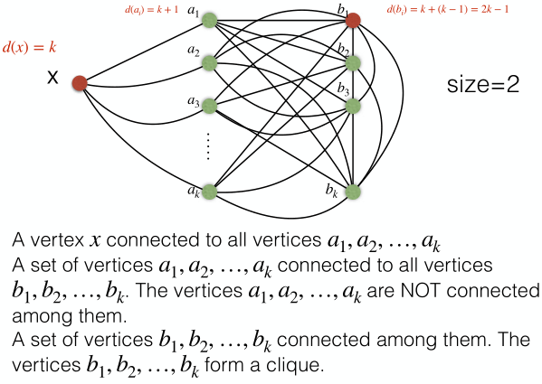
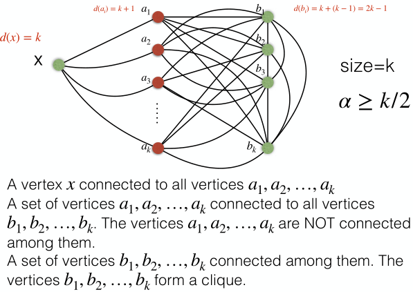

# Maximal/maximum independent set

## Definition

An independent set I ⊆ V is a set of unconnected vertices,
ie. no two vertices ∈ I are adjacent.
As with matching, the problems here is
finding a maximal or maximum independent set.

## Greedy maximal independent set

Here the idea is simply to take any arbitrary vertex,
then adding others until no other vertex not adjacent to any ∈ I exists.

## Greedy maximum independent set

Similar to matching problem solutions.

	Let G = (V,E) a connected graph.
	SOL ← ∅
	while V ≠ ∅
		u ← vertex of minimum degree ∈ V
		SOL ← SOL ∪ u
		V ← V - {v: v adjacent to u}
	return SOL

### Approximation ratio

Here again this algorithm does not guarantee an optimal solution.

Example:

Here the algorithm would choose X first since it is of lowest degree,
then b₁,
since a₁,…,a_k then b₂,…,b_k are pruned,
hence |SOL| = 2.

However the optimal solution is {a₁,…,a_k},
of size |SOL∗| = k.

Here again the approximation ratio is not constant:
α ≥ k / 2.
The approximation is worse the bigger the graph is.

### Deterministic size theorem

	Theorem: |SOL| ≥ n / (Δ+1)
	where n = |V|,
	and Δ = max degree of G
	(proven)

This theorem essentially specifies that the greedy algorithm
cannot do worse than n / (Δ+1),
eg. return a maximal independent set smaller than this.
It gives a deterministic lower bound, which depends on the graph's degrees.

	In the previous example,
	n = 1 + k + k = 2·k + 1,
	and Δ = 2·k - 1,
	hence |SOL| ≥ (2·k + 1) / (2·k).

#### Proof

	A vertex u is in V - SOL because it has been removed
	as a neighbor of a node v ∈ SOL.

	For each node v ∈ SOL,
	there can be at most Δ vertices assigned to it (excluded by it) by definition.
	Therefore,
	|V-SOL| ≤ Δ·|SOL|.

	Since every vertex is either in SOL or in V-SOL,
	|SOL| + |V-SOL| = n.
	Thus,
	n = |SOL| + |V-SOL|   ≤   |SOL| + Δ·|SOL| = (Δ+1)·|SOL|.
	Therefore n / (Δ+1) ≤ |SOL|.

An example where |SOL| = |SOL∗| is a clique,
where |SOL∗| = 1,
and |SOL| ≥ n/(n-1+1) = 1.

### Corollary

	The greedy algorithm has an approximation ratio of Δ+1.

#### Proof

Since the maximum size of the independent set is n,
the approximation ratio is |SOL∗|/|SOL| ≤ n / (n/(Δ+1)) = Δ + 1.

## Exact algorithm

Unfortunately, the maximum independent set problem is NP-complete,
and there is no solution in polynomial time.

## Relationship with vertex cover

One is opposed to the other.

A vertex cover VC is a set of vertices covering all of E,
ie. for any edge {u,v} ∈ E, at least one of its vertices is ∈ VC.

By definition, there can be no edge connecting any vertices in V - VC,
thus V - VC is an independent set.
