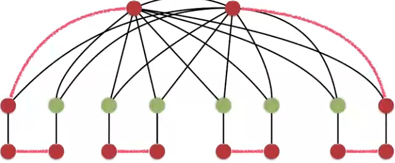
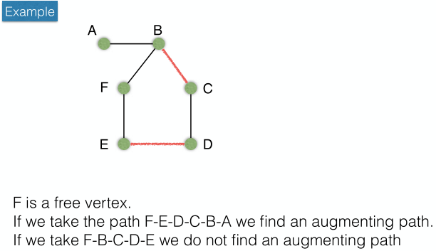

# Maximum/maximal matching (fr. couplage maximal/maximum)

## The kidney donor problem

A real-world application for vertex cover
is finding out how to distribute a set of donated kidneys
to a maximal number of compatible patients.

Donors have only one kidney to give,
only donate to patients,
and patients cannot exchange kidneys.
In addition, donor and patient can be incompatible.

We can model this situation using a connex directed bipartite graph
between donors and patients.
We're looking for a maximal size set of disjoint edges
which cover all patients
(thus all donors as well):
ie. one donor per patient.
This corresponds exactly to the GreedyVC 2-approximation algorithm above.

It is a fusion problem, usually known in the wild as the marriage problem,
where compatible couples must be made.

## Definition

A set of edges M ⊆ E is a *matching*
if no vertex ∈ V is incident to more than one edge in M,
ie. if no 2 edges ∈ M have a vertex in common.
Matchings are also referred to as independent edge sets.

A matching M is maximal
if ∄ M´ ⊃ M,
ie. there is no matching of bigger size properly containing M,
ie. there are no additional disjoint edges that may be added to M.
A maximum matching is a maximal matching of maximum size.

In general, when asking if there can be a matching of bigger size than M,
one can consider whether or not |V| is sufficient:
a matching of size 5 can by definition only exist if |V| ≥ 10.

As will become apparent in the following sections,
finding a maximal matching is relatively easy,
while finding a maximum matching is very difficult.

## A greedy maximal matching algorithm

	let G = (V,E) be a connected graph.
	SOL ← ∅
	while more edges can be added to SOL
		{u,v} ← edge where u,v are not common vertices of any edge ∈ SOL
		SOL ← SOL ∪ {{u,v}}
	return SOL

### Proof

Suppose SOL is not a maximal matching.
It follows that ∃ e ∉ SOL
such that e is not incident to any edges ∈ SOL.
This is impossible because of the loop
which would capture such an edge.

### A greedy maximum matching algorithm

	let G = (V,E) a connected graph
	SOL ← ∅
	remaining ← E
	while more edges can be added to SOL
		{u,v} ← edge with no common vertex in edges ∈ SOL
			AND u or v is a vertex of minimum degree
			in the graph induced by the remaining edges
		SOL ← SOL ∪ {{u,v}}
		remaining ← remaining - {e: e incident to u or v}
	return SOL

Here we choose edges with lowest degree edges
to prune a minimum number of edges

### Optimality

It is easy to show that this algorithm
does not guarantee an optimal solution
with an example

The maximum matching problem is not NP-complete,
so there is an optimal solution in polynomial time.

## Augmenting paths (fr. chemin croissant)

Let M be a matching of graph G=(V,E).
A path is *alternating* is its edges alternate between M and E - M.

	f    a    b    c    d    e
	•----•====•----•====•----•
	  ¬M    M   ¬M    M   ¬M

An alternating path is termed *augmenting*
if both of its endpoints
(eg. the first and last vertex of the path)
are free.

	In the example above, f and e are free,
	the path is augmenting.

### Berge's theorem

	A matching M is maximum if and only if it has no augmenting path.

Given an alternating path like in the example above,
we can invert edges ∈ M and edges ∉ M.

	Instead of taking {{a,b}, {c,d}},
	we could take {{f,a},{b,c},{d,e}},
	which is of higher cost.

Having chosen one vertex,
how to extend the matching?
We can select two adjacent edges and invert the selection
to only include those two.
To attempt to find the maximum,
we just extend by adding more edges
while verifying the definition of matching.
In other words, if we haven't found the maximum matching,
the path is surely alternating.

### Using augmenting paths for maximum matching

To find a maximum matching,
we can get augmenting paths and invert their edges
until there are no more of them.

In order to find agumenting paths,
we can do the following:

	Given a maximal matching,
	find a free vertex and use it as a root,
	then perform a DFS.
	Keep track of the distances from root of each encountered vertex.

	To alternate between edges ∈ M and edges ∈ E - M,
	when reaching a new vertex,
	if it is at an odd distance, then we choose an edge ∈ M to continue,
	else we choose an edge ∈ E - M.

	If we reach a free vertex at odd distance from the root,
	we have found an augmenting path.

Example:

#### Problems

The example shows two possible paths.
The problem is odd cycles:
it is difficult to know in which direction to continue the path.
Without odd cycles, this algorithm works:
we can just perform a DFS starting from any vertex,
and either we find an augmenting path,
or we have arrived at maximum matching.
This can be proven, but we won't bother here.

With odd cycles,
whatever edges are in the matching,
there is a free vertex
incident to two edges not part of the matching.
Only one of them will belong to the _maximum_ matching,
hence if the graph is traversed the wrong way,
we would miss an augmenting path.

This algorithm is thus applicable to *bipartite* graphs,
since they cannot have odd cycles,
but not other ones.

### Edmond's algorithm (1963, Jack Edmond)

This algorithm provides a concrete way
to find augmenting paths efficiently
in the general case,
running in polynomial time:
O(mn²).

However, its implementation is very complex.

## Relationship with vertex cover

### General case

	Theorem: for graphs in the general case,
	the size of a minimum vertex cover
	is at least the size of a maximum matching.

Since all edges of a maximum matching are disjoint,
at least one vertex is need in the cover for each.

### König's theorem

	For bipartite graphs,
	the size of minimum vertex cover is equal
	to the size of a maximum matching.
	(proven)

This is an interesting result.
König's theorem essentially tells us that
a vertex cover problem, which is NP-complete,
can be solved as a maximum matching problem,
in polynomial time.
