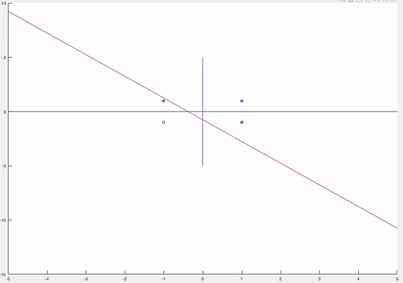
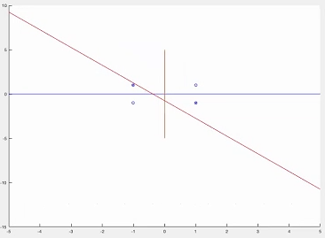
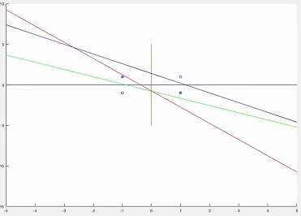
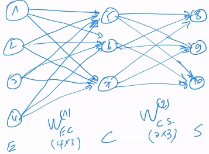
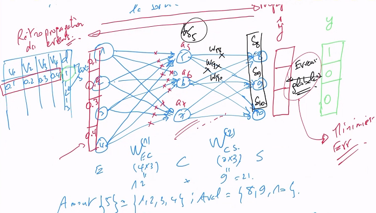

# Neural network supervised learning

## Context

Generally, a supervised learning approach
is used to construct a classifier from a database of labeled examples,
to predict labels of new individuals.

Often getting the labels is very expensive in time and other resources,
for instance with anatomopathology samples.
Therefore, a majority of individuals in the learning db can be unlabeled.
We could do supervised learning on the labeled part,
but we would have few individuals,
ie. the classifier's "generalization capacity" would be very weak.
We can instead focus solely on the unsupervised part,
on the unlabeled data.

However, we would again lose information,
since we ignore expert information.
Therefore, we'd perform semi-supervised learning instead
using both data to construct a more precise classifier
than when only using the labeled data.
This works by first building a weak classifier on the labeled data,
then augmenting it with high-confidence predictions from the unlabeled data.
The algorithm learns itself by injecting new individuals into its supervised db.

	self-training, co-training, tri-training, ensemble training etc.
	given the number and types of algorithms used

Other techniques start from everything using clustering,
but the clustering results will be guided
in that labeled data of the same class must be clustered together.
This is constraint-based clustering:
constrainsts are built from expert decisions.
One advantage of this type of method
is being able to subdivide a known class into subclasses
that see the same thing differently
based on different characteristics/subtypes/behaviors.

A learning db could have multiple labels to predict.
Intuitively this translates into a matrix with n variables' columns
and m additional columns for labels.
This calls for multilabel learning techniques,
often adaptations of simpler ones.
In this case, the correlation between labels must be taken into account.

In case there are more than 2 classes for a label that we have to predict,
we do multi-class learning.
We could have _imbalanced_ labels,
where one class is very rare,
for instance fraud prediction,
where classical techniques would not work
since that class would be difficult to learn.
This is imbalanced learning.

If we don't used ordinal classes, but real classes,
for instance prices,
we enter into regression learning.
We use some techniques defined in either case,
what changes is the functions used for learning
and the performance metrics.

### Variable selection

The problem may be not to predict a class,
but to understand what makes it distinct,
ie. which are the characteristic/pertinent variables inherent to it,
for example which variables enter into play for sick or healthy patients.

Here we want to select a subset of variables
that would _best_ allow predicting whether an individual belongs to this class or not.
This allows us to reduce the size of the database.

Using many variables can give rise to multiple problems.
One is presence of a lot of noise which would falsify/bias results.

Variables may be redundant (very correlated)
which again would degrade quality and/or performance
(for instance some algorithms would alternate between choosing one or the other,
as if this variable's importance is divided by two).
Removing a redundant variable could give more importance to the first.

A further problem is the _curse of dimensionality_
(fr.: fléau de redondance).
In medical data, we usually have few individuals but many variables.
The bigger the variable space,
and thus also the bigger the redundancy between variables,
the more will classification and performance problems be severe.
In this case, the algorithm will have too many choices.

The goal here therefore is to select the most informative variables,
to have the best comprehension on the underlying process generating the data,
and the algorithm's performance.
This obviously also has an important impact in terms of costs,
esp. for medical data,
for instance having to only a few variables for each patient,
rather than hundreds.

## The formal neuron

A treatment unit which receives an input vector X
and returning a real output S based on a vector of connection weights W
of the same dimensions as the input data.

	X = (x₁, ..., x₏)
	W = (w₁, ..., w₏)

To arrive at the decision S, there are two successive transformations.
The first F is linear and uses X and W to calculate its activation a.
The second f is non-linear and calculates S.

	a = F(X,W)
	S = f(a)

f can be a threshold function, or sigmoid, identity, hyperbolic function, etc.

	x₁   ­→
	x₂   ­→
	x₃   ­→     < F(X,W) → a → f(a) >    →    S
	…    ­→
	x₏   ­→

There are two types of formal neurons.
The scalar/dot product neuron produces F from the dot product of X and W.

	F(X,W) = <X,W> = ∑ᵢ₌₁ⁿ wᵢ·xᵢ

The distance neuron is still defined by F(X,W)
but is obtained by a norm between the two vectors X and W.
This corresponds in a way to the euclidean distance between the two vectors.

	F(X,W) = ⏸X - W⏸²₂

If the weights are normalized, a link can be made between the two neuron types.

	⏸X - W⏸²₂ = ⏸X⏸² + ⏸W⏸² - 2<X,W>
	↑distance			↑dotproduct
	⏸X⏸² > 0, ⏸W⏸² > 0
	if W normalized to X, 2<X,W> > 0

When 2<X,W> is very large, the distance plummets, and vice-versa.
Small distance means the neuron (W) is close to the data (X),
which implies that X contributes largely to activation,
meaning the dot product is big.
Same for large distance.

## ADALINE: Adaptive linear element

### Definition

Input data is supposed to be in n-space,
that is each xᵢ is a vector of n dimensions.
Since we are doing supervised learning,
to each vector is associated expected output D.

	X = x¹, … , xⁿ
	D = d¹, … , dⁿ

xᵢ are termed _variables_.
Each sample is n-dimensional with one value for each variable.

ADALINE is a linear, adaptive, 2-class model,
which computes an output y based on connection weights W,
such that:

	y = w₀ + <W,X>
	= straight line

w₀ is the bias unit,
without which y would always go through the origin 0,0,
which reduces the search range.
It is added to extend the search to the entire search space.

	"élargir le spectre de recherche de solutions de séparation
	entre les données d'une classe et les données d'une autre."

Mathematically, the equation of the curve representing the ADALINE
is of the form:

	w₀ + w₁x₁ + … + w₏x₏ = 0

ie.:

	w₀*1 + w₁x₁ + … + w₏x₏ = 0

If we omit w₀, the curve will always pass through the origin, which
does not allow us to explore the full problem space.
w₀ allows the curve to be offset anywhere in addition to changing its slope.

In summary, ADALINE is a linear model for two-class problems,
with an adaptive element.

### Algorithm

We want a stable and interpretable method with minimum error.

	"initialisation → modèle bête,
	puis rendre le modèle intelligent/intélligible/interprétable
	pour le client non-expert"

1. at t=0, W is initialized arbitrarily/randomly
2. get a data x^k and output d^k
3. compute distance e between output and expected output

	e = d^k - <W,x^k>
	dotproduct result is scalar, d^k must also be scalar
	therefore e is scalar

4. compute approximation Δ

	Δ = -2·e·x^k
	x^k is a vector, therefore Δ is a vector

5. recompute weights

	w(t₊₁) = w(t) - εΔ
	ε: learning step

6. repeat 2.-5. until stability (convergence):
for each xᵢ, and over multiple passes over the db

The formula for e seems intuitive,
but the one for Δ much less so.
In general, we want to calculate and minimize an error term.
The error here is committed by the model,
which is represented by w.

There is some error function Err() committed by the model,
hence with w as its parameter,
and is the difference between desired output and model output.

	Err(w) = (d^k - w·x^k)²

We want to minimize it.
Mathematically, we have to calculate its derivative.

	∂Err(w)/∂w	= -2·x^k·(d^k - w·x^k)
			= -2·e·x^k
			= Δ
	we want ∂Err(w)/∂w → 0

At step 5, we want Δ to tend towards 0 in successive iterations,
with a "descent regulator" term, or "gradient descent", ε.
as Δ is minimized, so is the difference between w(t₊₁) and w(t),
until they are equal and stability is achieved.

### Example: learn logical OR using ADALINE

Let D a 2D data matrix with rows for `samples' and columns for `variables'.
Logical OR is a binary operator, hence 2 variables and 2² = 4 possible values,
therefore: 4x2 matrix.
Let's assume true=1 and false=-1.
Let d be the vector of desired output.

	#	V₁	V₂	d
	1	1	1	1
	2	1	-1	1
	3	-1	1	1
	4	-1	-1	-1

We have thus modelized the problem as a learning dataset.
We could visualize this as a simplistic scatterplot:

        ⊗   1┼    ⊗
	     │
	┼────┼────┼
	-1   │    1
	⊙  -1┼    ⊗

	⊗ class 1
	⊙ class -1

By initializing the weights arbitrarily,
we essentially draw an arbitrary line:

Then, at each iteration,
the algorithm will compute approximation distance and adapt weights,
and the curve will move in 2D space until convergence.

It is these final weights that are finally accepted
to test the model, ie. if new data is well separated.

## MADALINE: Multiple adaptive linear element

### Example: XOR ⊕

	#	V₁	V₂	d
	1	1	1	-1
	2	1	-1	1
	3	-1	1	1
	4	-1	-1	-1

        ⊗   1┼    ￮	⊗ class 1
	     │     	￮ class -1
	┼────┼────┼
	-1   │    1
	￮  -1┼    ⊗

It is obvious that in the graphical representation,
there are two overlapping classes
(just draw ellipses containing both points of each class).

ADALINE cannot resolve this since it is a linear classifier,
ie. no matter how the straight curve is moved in the problem space,
it will not separate the two classes.
No given initialization or number of iterations would help.

It's a simple problem representing a non-linear distribution,
hence the need for a different classifier.

As an aside, it is important to visualize the data's distribution,
for which there exist many methods.
In this case, we're in a 2D problem space.
In a multidimensional space, we can't tell.
We use methods such as PCA for dimension reduction,
if nothing else to allow visualization.

In other words, MADALINE is a falsely non-linear model
for two-class problems.

### Definition

It is an extension of ADALINE,
a connectionnist model composed of a multiple layers:
a multiple ADALINE layer,
and a logical layer for decision making.

There are at least 2 ADALINEs,
each of which is linked by connection weights
to the variables or characteristics of the data.
Each input is linked to both ADALINEs,
which have two distinct weight vectors.
The two yield partial results feeding into a logical AND,
which yields the final decision.

		   /--------------------\
	x₁   ­→    ⎫w₁
	x₂   ­→    ⎬…   ­→ <A₁>  ­→  ⎫
	x₃   ­→    ⎭w₏               ⎬  ∧  ­→  s
	x₄   ­→    ⎫w₁               ⎪ 
	…    ­→    ⎬…   ­→ <A₂>  ­→  ⎭
	x₏   ­→    ⎭w₏
		   \--------------------/

MADALINE decomposes a nonlinear problem into a combination of linear ones.
It is used especially when there is a priori knowledge of the problem.

	"non-linéaire mais avec détournement de la linéarité,
	pas un traitement propre de la linéarité."

### Example, contd.

XOR can be expressed using other logical operators,
which forms the a priori knowledge on it.

	XOR ⇔ ∨ and ¬∧		; OR and NOT AND

We compose the target d into two problems/targets d₁ and d₂:

	#	V₁	V₂	d₁=∨	d₂=¬∧	(d=d₁∧d₂)
	1	1	1	1	-1	-1
	2	1	-1	1	1	1
	3	-1	1	1	1	1
	4	-1	-1	-1	1	-1

If we put an ∧ between d₁ and d₂, we arrive at the d we had previously.
We use the same db with V₁,V₂,d₁ to learn the first model, A₁,
and V₁,V₂,d₂ to learn A₂.

Decision: anything in the space between the two curves is part of the first class,
and anything outside of that is part of the second:
model1 AND model2.

## Perceptron

### Definition

Multi-layer connectionist model.
The first layer modelizes the variables,
the second encodes the variables
(in cases where the variables are not the same,
or have different weights),
and the last one is a decision layer.

		   φ
	x₁   ­→    φ₁   ­w₁→
	x₂   ­→    φ₂   ­w₂→    /-----\
	x₃   ­→    φ₃   ­w₃→    F ­→  f  ­→  s
	…    ­→    …     …      \-----/
	x₏   ­→    φ₏   ­w₏→

Each variable passes through a vector of filters φ
which attributes weights to each.
Filter outputs have weighted connections to a single formal neuron,
as usual.
Input passes through a linear activation function F,
and a nonlinear decision function,
yielding a final decision s.

The perceptron minimizes a classification error
using the connection weights w.

	if w^k·φ^k > 0
		x^k ∈ c₁	(d=1).
	else
		x^k ∈ c₂			(d=-1).

In other words, the perceptron is a linear model
for two-class problems.

Like ADALINE and MADALINE,
perceptrons are based on the concept of the formal neuron,
with passage through 2 transformation functions,
one linear and one non-linear.

The main difference between ADALINE and perceptron
is the necessity of a test between calculated output and desired output
to check whether it should adapt,
while ADALINE always adapts until the error is minimized.

### Algorithm

1. t=0: arbitrary initialization of w
2. get a data x^k and desired output d^k
3. calculate output

	y^k = f(<w^k·φ^k>)

4. update w based on classification error: test, if equivalence, no change

	if y^k = d^k,
		w(t₊₁) = w(t)
	else
		w(t₊₁) = w(t) + ε·φ^k·d^k

5. repeat 2→4 until stability/convergence.

### Example: logical OR

Same as previous result with ADALINE.
In general, it is much faster, but less robust.
ADALINE looks for the best separation,
while the perceptron stops once a separating hyperplane separates all data.
It is based solely on the learning data,
and points from test data which do not fall within the established borders
will be misclassified.

In the example, the separation curve is found fast,
but one can easily imagine that a suboptimal one
could be reached just as well.

## Multiclass perceptron

### Definition

Suppose p classes {c₁,…,c_p} to separate.
Like MADALINE, this uses the perceptron to work around the multiclass problem,
by using as many perceptrons as there are classes.
Therefore, this model learns multiple weight vectors {w₁,…,w_p}.

	∀i∈{1,…,p} ∀j≠i∈{1,…,p},
		if wᵢ·x^k > wⱼ·x^k,
			x^k ∈ cᵢ

		   φ         ⎫w₁   /-----\
	x₁   ­→    φ₁   ­→   ⎬…       P₁     ­→
	x₂   ­→    φ₂   ­→   ⎭w_p  \-----/        ↘
	x₃   ­→    φ₃   ­→            …       …   →   MAX   ­→   s
	…    ­→    …     …   ⎫w₁   /-----\        ↗
	x₏   ­→    φ₏   ­→   ⎬…      P_p     ­→  
	                     ⎭w_p  \-----/

Each perceptron model has its own connection weights to each variable,
and provides its own output.
They "compete", and one maximizing the output s is selected.

### Algorithm

1. t=0: arbitrary initialization of all the vectors w
2. get a data x^k and desired output cᵢ
3. calculate output cⱼ
4. update w based on classification error: test, if equivalence, no change

	if cᵢ = cⱼ,
		w(t₊₁) = w(t)
	else
		wᵢ(t₊₁) = wᵢ(t) + ε·φ^k		wᵢ: raise weight for desired class cᵢ
		wⱼ(t₊₁)	= wⱼ(t) - ε·φ^k		wⱼ: reduce weight for output class cⱼ

	cᵢ and cⱼ are the only ones involved in the conflict,
	so others are untouched:

		∀l≠ᵢ∧l≠ⱼ
			w_l(t₊₁) = w_l(t)

5. repeat 2→4 until stability/convergence.

## Multilayer perceptron (MLP, fr: perceptron multicouches)

### Definition

Same structure as perceptron or ADALINE,
but with added intermediary hidden layers.
We wish to treat both non-linear and multi-class problems.

We thus have external layers:
- entry layer E (entrée): modelizes the variables
- output layer S (sortie): modelizes the classes

We add internal layers:
- hidden layer C (caché): modelizes the complexity of the problem

Notation:

	<E|C|S> = <4|3|3>
	4-neuron E layer, 3-neuron C layer, 3-neuron S layer

In addition, let two functions amont(k) and aval(k):

	amont(k) = {neurons whose outputs are k neuron's inputs}	// preceding
	aval(k) = {neurons whose inputs are k neuron's output}		// succeeding

Where we had connection weight vectors for ADALINE and perceptrons,
we now have matrices W_EC(1) of dimension |E|,|C|
and W_CS(2) of dimension |C|,|S|.
The number of connections explodes quickly.

Learning starts with a learning database.
The number of variables is the number of neurons in E.

We propagate the data from left to right,
which circulates each vector of the input db to the output,
then a global error is calculated,
which is then decomposed into local errors of each neuron,
ie. retropropagation.
These round trips let the model adapt its weight matrices,
until the global error is minimized.

Initially popular in the 70's and 80's,
MLPs were abandoned because of the intermediate layer's complexity.
It's not possible to pile up multiple layers,
or have lots of neurons,
since the number of parameters blows up.
With growing compute power and especially computations on GPU,
there were attempts to leverage this power to increase the number of neurons
in a single hidden layer.
Unfortunately, this leads to "fat" networks,
which automatically leads to overfitting.
Instead, we add more layers with a reasonable number of neurons.
It became apparent that in such an approach,
the maximum of information is carried by the hidden layer
immediately preceding the output layer.
By playing around with the architecture of these models,
many others were made,
such as convolutional models (CNN),
temporal models (LSTM),
which take into account temporal distorsion,
like in speech or text where data represents temporal events.
Deep networks use this kind of models.
The game is in playing with the architecture.
Currently, there is work on interpretability of these deep models.
Even if the results are extraordinary,
they remain experimental, since the theory isn't yet rock solid.
They outperform other models when data is abundant,
but is this intelligence,
seeing all the data representing the distribution in the entire universe?

#### Algorithm

1. Initialize arbitrarily the two weight vectors w(1)_EC, w(2)_CS
2. Get data x^k with its class y^k
3. Propagate x^k the data through the network: calculate activation" aⱼ and f´(aⱼ)

	∀j∈C,
		aⱼ = w(1)_·ⱼ + ∑ᵢ∈amont(j) w(1)ᵢⱼ·xᵢ

This is again a linear transform.

3.a. Calculate output of neurons ∈ C

	∀j∈C,
		Zⱼ = f(aⱼ)
		w(1)_·ⱼ + ∑ᵢ∈amont(j) w(1)ᵢⱼ·xᵢ

f() is a non-linear function, such as sigmoide, hyperbolic tangent, etc.

3.b. Calculate activations of neurons ∈ S

	∀k∈S,
		a_k = w(2)_·k + ∑ⱼ∈amont(k) w(2)ⱼk·Zⱼ

3.c Calculate output of the model, using the same non-linear function

	∀k∈S,
		yhat_k = f(a_k)

4. Calculate local errors

We then have to compare the yhat vector (|yhat| = |S|)
with a y vector of desired output (|y| = |S|),
which in a way check the element corresponding to the desired class
(1 there 0 elsewhere).
Confronting yhat to y yields a global model error.
Each neuron participates in that error,
so we have to calculate local errors in C and in S.

	if j∈S
		δ^kⱼ = f´(aⱼ)·(yhat^kⱼ - y^kⱼ)
	else if j∈C
		δ^kⱼ = f´(aⱼ)·∑h∈aval(j) wⱼh·δ^k_h

In other words, for C,
we apply the derivate of the nonlinear function
on the activation of the neuron ∈ C,
multiplied by the local errors of S,
weighted by the connection weights between the C neuron
and outgoing neurons.

5. Adapt the weights

	wᵢⱼ(t₊₁) = wᵢⱼ(t) - ε·δⱼ·f(aᵢ)

6. Repeat 2→5 until convergence

#### Example

	E	C	S
	1	5	8
	2	6	9
	3	7	10
	4

	5,6,7 each connected to all of 1,2,3,4
	8,9,10 each connected to all of 5,6,7
	amont(5) = {1,2,3,4}
	aval(5) = {8,9,10}

	|E| = 4, 4 variables
	d: classes
	given the architecture, we have ≤ 3 classes.
	eg. c = {1,2,3}

	zB:
	V₁	V₂	V₃	V₄	d
	0.1	0.2	0.3	0.4	1	← let's take this vector, v
	…	…	…	…	2

Each neuron will take one of the components of v.
v is then propagated across the network.
We first calculate the activations of 5,6,7.
To calculate a₅, we simply take the vector v
and weight it by the vector of connection weights
from incident neurons in E (amont(5)).

	y = (1 0 0)	(or (1 -1 -1))

	δ₅ = f´(a₅)·(δ₅,δ₆,δ₇)[ w₅,₈ w₅,₉, w₅,₁₀ ]

## Exercises

### ADALINE

We wish to learn logical AND.
Modelize the problem for learning it using ADALINE
with a step ε = 0.1,
and initial weights (w₀, w₁, w₂) = (0.3, 0.8, 0.4).
Unroll one iteration.

	Assume true=1, false=-1.
	W is of length 3, so we have 3 corresponding variables.
	V₁ and V₂ are the possible values on each side of the AND operator.
	V₀ then must be always 1 so as to not influence the desired result d.
	w₀ is the bias term.

	Therefore, let D be the following matrix:

	#	V₀	V₁	V₂	d
	1	1	1	1	1
	2	1	1	-1	-1
	3	1	-1	1	-1
	4	1	-1	-1	-1

	We now proceed to learning starting with the first sample:
	X = (1 1 1), d = 1.
	e	= d - <X,W>
		= 1 - (0.3 0.8 0.4) [1\ 1\ 1]
		= -0.5
	Δ	= -2 * (-0.5) (1 1 1)
		= (1 1 1)
	w(1)	= w(0) - ε * Δ
		= (0.3 0.8 0.4) - 0.1 * (1 1 1)
		= (0.2 0.7 0.3)

	Iteration 2:
	X = (1 1 -1), d = -1
	We calculate e, Δ, then use w(1) to compute w(2).
	And so on.

	We repeat with the remaining samples.
	When we reach w(4), we wrap around and start over with the first sample.
	This repeats until w(t) stabilizes.
	We will obtain in the end:
	w∗ = (-0.5 0.4286 0.3571)

	Visually, we can see that the final curve separates the samples well.
	We need a computational method to verify this.
	We'll take each of the samples and test them one by one,
	by multiplying them by the final w.
	If the result is ≥ 0, it's in class 1, and -1 otherwise.

	1: (1 1 1) [-0.5\ 0.4286\ 0.3571] > 0	⇒ s = 1.
	s = d ⇒ ok.
	2: (1 1 -1) [-0.5\ 0.4286\ 0.3571] < 0	⇒ s = -1.
	s = d ⇒ ok.
	etc.

### MADALINE

## Decision trees

### Definition

This is an auto-informative model,
ie. it not only predicts
but also explains how it predicts,
which has its advantages.
It takes descriptor variables,
partitions representation space of the variables using them,
to separate individuals between classes.
This is called a _discriminating algorithm_.
A decision tree for delivering credit to an individual or not
will detect "bad" individuals not to lend to,
and thus distinguishes between reliable and unreliable individuals,
based on description variables
such as "stable employment", "house ownership", etc.

Thus classifying with DTs is a recursive division of data space
into subregions that are purer and purer in terms of classes.
Initially the data has a mixture of classes,
and the DT aims to separate individuals,
taking into account differences between strata in each given class.
In other words, variables allowing separation between individuals
may be used differently to achieve it.
"pure" regions contain only individuals of one class.

The classification problem is decomposed into a series of (nested) tests
on one variable (parallele to axis)
or a combination of variables (oblique).
Tuples are placed in the class associated with the subregions they verify.
There are various methods based on how the tree is built.

### Example

Let's take a simple (unrealistic) example
of 8 individuals described by 4 characteristic variables.
We wish to predict a variable
defined as whether a client would check his account balance online or not,
based on the variables M "balance mean", A "age", R "residence type" and E "college education".
If we propose internet access to everyone,
we might have bottlenecks, high servers costs, etc.,
so we instead want to find out which clients would be interested in it.

The DT will separate individuals based on their label and variables.
Initially, there are 3 individuals who check online, 5 who don't.
M has three possible values: low/mid/high.
For each of these values, we determine how many check online and how many don't.
We do the same across all variables.

It is apparent that if the DT tests on M,
there will always be a doubt.
weak/mid are impure,
but high is _eupure_:
no mixture between classes,
it's what we want.
We can say that a test on M=high is ok,
but not M=low or M=mid.
Same for the rest.
An equidistributed space yields no information for a decision.

Using this approach, we see that tests on R are not great.
We have M=high, A=young, A=old, E=no.
E is ok on one branch but not on the other.
So which is better?

### Test metrics

We want functions which can represent intuitions we may have on variables.
They must be minimal when the node is pure,
and maximal when node is equidistributed.
The result will be different depending on the function used.

A DT may select the variables that separate the data best in its algorithm,
but other methods may select different ones,
and the ones chosen by the DT are not necessarily "good".
It's a greedy algorithm choosing local optima,
and these problems are often NP-complete.
Because they choose local optima,
they are said to learn "by heart".

#### Entropy algorithms

Entropy measures chaos in thermodynamics,
and has later been adapted to information theory.
It's the sum of the product between class probabilities
and their logarithm.

	Entropy(p) = -∑_k=1^c P(k/p)·log(P(k/p))

An algorithm using entropy is called _C4.5_,
the name of a known algorithm.

Entropy varies between 0 (pure) and 1 (equidistributed).
Starting with the first node,
we have 3 who check and 5 who don't,
hence class probabilities 3/8 and 5/8.

	general entropy:
	Entropy(∈)	= -3/8·log(3/8) - 5/8·log(5/8)
			≅ 0.954

Then, for variable M, we'll calculate entropy for each of its values
(low/mid/high), where we have (1,2) (2,1) (0,2).

	Entropy(1)	= -1/3·log(1/3) - 2/3·log(2/3)
			≅ 0.918
	Entropy(2)	≅ 0.918
	Entropy(3)	≅ 0

To get the M node's capacity to separate (quality of the test on M),
We'll consider that global entropy has been calculated on 8 individuals,
and weak/mid/high on 3/3/2 individuals.
We'll therefore calculate an entropy reduction:
a good node will reduce entropy.
This corresponds to the gain function.

	Gain(∈,M)	= Entropy(∈) - (3/8·Entropy(1) + 3/8·Entropy(2) + 2/8·Entropy(3))
			= 0.954 - 0.688

In the end:

	Gain(∈,M)	= 0.266
	Gain(∈,A)	= 0.454		← best
	Gain(∈,R)	= 0.016
	Gain(∈,E)	= 0.348

This corresponds to our earlier intuition.

#### Gini

Here the function is the sum of the squared class probabilities.

	Gini(p) = 1 - ∑_k=1^c P(k/p)²

An algorithm using Gini is called _CART_
(classification and regression tree).

For example:

	Gain(∈) = 1 - (3/8)² - (5/8)²

The results will be different than those with entropy.

#### Gain

The gain function calculates the difference
between the entropy or Gini of a parent node,
and the sum of the product of child probabilities and their entropy or Gini.
We select the test of highest gain.

	Gain(p, test)	= i(p) - ∑ⱼ₌₁ⁿ Pⱼ·i(pⱼ)
	where:
		p position
		Pⱼ proportion of elements ∈ S at the position p that go to position pⱼ
		i(p): entropy(p) or Gini(p)

This isn't the gain of a node, but of the test.

### Example contd.

Using entropy calculated previously on the example,
we can be confident that A=young predicts checking
and A=old no checking.
However for A=mid, we don't know and we still have a mixture.
The algorithm will continue doing the same in a recursive manner.

### Algorithm

S ← input sample
T ← ∅		// empty tree
node ← root
while T ≠ DT		// DT if no nodes without class
	if node is terminal
		assign a class
	else
		select a test and create a subtree
	node ← next unexplored node

There are two choices here.
Either we compute until the end,
ie. using all variables
until everyone is separated,
or we perform tree prepruning (fr. élagage),
ie. stop construction of the DT at a given level.

### Example contd.

We will now use the remaining variables to separate
the individuals we couldn't with the first two pure classes.
With qualitative variables,
when we use one variable on one branch,
it cannot be reused,
since even if we do, it wouldn't bring any benefit.
However, with quantitative, real, variables,
we could have a first test with thresholds,
for example age<17, age≥17,
but we could reuse age later:
for all age≥17, we could test if age≥35.

We do the same with unused variables for all impure regions.
For calculations, we use the individuals from those impure regions,
rather than all individuals like in the first step,
ie. if 4 individuals remain,
each of the remaining variables will have branches for their possible values,
with the corresponding number of individuals _within_ the remainder.

### Classification performance metrics

A learning algorithm must never be tested on the learning db.
Often, we keep a distinct db for testing.

In the same example, we may get 4 additional samples
that were not used in learning,
and which are projected onto the DT.

The first one is misclassified by the DT,
with A=old but Re=1.
We build a contingency table from this,
and derive metrics:

	         Pr
	       +   -     
	Re +   2   1    ⇔    TP   FN
	   -   0   1         FP   TN

	accuracy	= 3/4
			= 75%
		ratio of correct predictions
	error		= 1 - accuracy
			= 1/4
			= 25%
		ratio of incorrect predictions

Two more metrics are recall and precision,
by class.
We'll wish to optimize recall or precision,
depending on application.
Recall for a class is the ratio of
the number of individuals in that class attributed by the algorithm,
and the number of individuals really in that class (reality).

	recall(+)	= TP / (TP + FN)
			= 2/3
			= 66%
		we take the row corresponding to all Re+
		33% of clients that would be interested in the internet offer
		are ignored

Precision is the confidence of a prediction.

	precision(+)	= TP / (TP + FP)
			= 2/2
			= 100%
		we take the column corresponding to all Pr+
		ie. we have 100% confidence in a + prediction
		if we predict that an individual would use the offer,
		we are 100% confident.

Often recall is more pertinent in medical sciences,
search engines, etc.
in order to get the most pertinent results.
In marketing, precision is more pertinent.

For example, an advertising company would like to send prospectuses,
which will have a certain cost between printing and sending.
What we want is that a client we have sent a prospectus to will buy.
Let's say that cost is 10 and sale is 50.
We have a capital of 1000, and can send to 100 clients.
If the algorithm has 50% precision,
50 would buy, 50 wouldn't,
and the benefit would be 2500.
If we had 80% precision, we would have 80% sales,
and 4000 benefit.
