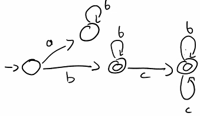
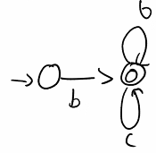

# Finite state automaton-based search

## Definition

The class of problems here is multiple patterns
for a single text.

An automaton on Σ is a 4-uplet (Q, q₀, foverbar, δ),
where Q is the set of states,
q₀ the initial state,
foverbar (f with an overbar if you can fucking input it) the final states,
δ the transition function: δ: Q · Σ → Q.
The transition function takes a state ∈ Q and a transition ∈ Σ
and outputs a new state.
An initial state can also be final.

A word W ∈ Σ is recognized by an automaton A = (Q, q₀, foverbar, δ),
if there exists a path from q₀ to a final state in foverbar
such that the concatenation of the characters of the transitions in the path
are equal to W.

The language L(A) associated to an automaton A
is the set of words recognized by the automaton.

	Example automaton on Σ = {a,b}:

	     ↙---b---↖
	-→ (1) --a-→ ((2))

	1,2: fsm states
	a,b: transitions
	(()): final state
	→(): initial state
	δ(1,a) = 2

	abababa is a word recognized by the automaton.
	this automaton's language is infinite:
	a, aba, ababa, etc.

## Reading a word

Let W be a word.
How do we check if W ∈ automaton's language?

We can read in a word and follow the transitions
starting from the initial state.
This is called reading a word in the automaton.

If we cannot make a transition between two characters in W,
the word is not contained in the automaton's language.
We also must arrive at a final state.

## Regular expressions

A regular expression on Σ is a sequence of elements of Σ,
a word ε,
et operators * and |.

There are only two operators we can define here:
- (a|b): character or string may be a or b
- a*: character occurs 0 or more times
- (a|b)*: any combination of the two characters/strings occurs 0 or more times
(example: (aa|bb): aaaabbaabbaabbbb)

Other operations can be added with the usual metacharacters:
+ * ? .
The . operator is sometimes noted Σ: aΣb is equivalent to a.b.
ε is the empty word:
(ε|b) means nothing or b.

Let L(E) be the set of words recognized by the regular expression E.

## Kleene's theorem

Let L ⊆ Σ.
There exists a regular expression such that L = L(E)
if and only if there exists an automaton A such that L = L(A).
In other words, regular expressions are automatons,
and their languages are those of automatons.
An automaton can be made unto a regular expression and vice versa.

The most useful conclusion is that given a regular expression,
we can construct an automaton which recognizes its language.

L ∈ Σ∗ is said to be rational (or regular)
if there exists an automaton A which recognizes it,
ie. L = L(A).

A must be a deterministic finite automaton
(see sections below).

An example of a irrational language is L₀ = {aⁿbⁿ: n ∈ ℕ},
ie. the set of words containing a number n of a's,
followed by the same number of b's.
We won't be able to make a regular expression which would match
this condition.

### Types of languages

In real applications,
motifs which can be searched for
can be modeled with regular expressions.
However, if their language is irrational,
it would not be possible to express them as such.

Chomsky defines a hierarchy of types languages.

	rational ⊆ context-free ⊆ context-sensitive ⊆ recursively enumerable

Context-free is aka algebraic.

Rational languages are associated to automata.
Algebraic languages contain irrational languages.
Context-sensitive ones contain natural languages.
Recursively enumerable languages are more complicated languages
that would be difficult to formalize.

Algebraic languages are important in computer science
as they are recognized by pushdown automata
(PDA, fr. automates à pile),
ie. automata employing a stack,
where programming languages belong.
Essentially, the difference with rational languages
is that the automata needs memory to handle algebraic languages.
Simple automatons cannot store any information aside from their current state.

As an example,
a programming language like python can be modeled as a PDA,
where syntactically valid expressions are words recognized by it.
This is commonly used in linters.

## Recent regular expression engines

Modern implementations use more powerful mechanisms,
such as (named) match groups
(fr. groupes de capture).

	a(l|p)b$1
	  $1
	Here, the first match group is named $1
	and is recalled right after.
	This can match:
		albl
		apbp

This example is an algebraic language,
but should we generalize this to allow any number of repetitions,
it won't even be an algebraic language, but a context-sensitive one.
The notion of context enters when there is a dependency on previous state.

	In the example, we need to know how $1 was defined to resolve it.
	If $1 is allowed a bounded number of times, this is an algebraic language.
	Otherwise, it's a context-sensitive one.

This simply implies that real-world regular expressions
are different that classical ones outlined before.

## Pattern-matching in a text

Let E a regular expression such as http://Σ*index.html (http://.*index.html).
Generally, it's not this word we're looking for,
but a matching motif.
In other words, we want to know if this pattern exists inside of a large text
(rather than the exact uninterpreted string).

Essentially, we check if the text is of the form Σ*EΣ*,
or here: Σ*http://Σ*index.htmlΣ*.
The text will then be part of the language if this pattern occurs within it,
ie. if it is recognized by the automaton.

## Strategy

Given a regular expression E,
we start by using Kleene's theorem to transform to an automaton.
We then add cycles for every character in Σ
at the start and end.

	Σ = {a,b}
	aaba           →()-a→()-a→()-b→()-a→(())

	                ↶a                   ↶a
	Σ*aabaΣ*       →()-a→()-a→()-b→()-a→(())
	                 ↺b                   ↺b

We can shorten the representation by using Σ as a shortcut
for the loop transitions.

Another example:

	                                ↗a↘
	Σ*aa(a|b)aΣ*       →()-a→()-a→()   ()-a→(())
	                     ↺Σ         ↘b↗       ↺Σ

	                                    ↶a
	Σ*aab*a(a|b)*cΣ*   →()-a→()-a→()-a→()-c→(())
	                     ↺Σ        ↺b   ↺b    ↺Σ

## DFAs and ambiguous paths

In the examples above,
traversing the automaton naively could very well lead to match,
just as it could loop on the first state and miss.

Previously, the assumption was that
there is only one exiting transition for every state,
labeled with a given character.

There are two types of automata.

An automaton is deterministic if and only if:
- it has a single initial state
- it has no ε-transitions (empty character transition)
- every state has at most 1 exiting transition by character ∈ Σ.

Otherwise it is non-deterministic.
The two are commonly named respectively DFA
(deterministic finite automaton),
and NFA.

Kleene's theorem is applicable to DFAs only.
The examples in the previous sections are NFAs,
which is necessary esp. for wildcards.

## Rabin-Scott's theorem: determinization

	Let L = L(A) the language of an NFA A,
	then there exists a DFA A´,
	such that L = L(A´).

This does not imply that a DFA can recognize
more languages than previously discussed,
but simply that an NFA can be determinized
as a different DFA.
There are many algorithms for this.

The transformation is not without consequences.
For an NFA with k states,
its determinization would yield a DFA with 2^k states,
a real practical limit.

## Minimal automaton

Given a regexp or language,
there can be many automata recognizing that same language,
ie. many different translations as an automaton.

	L = ab*
	All three of these automata can recognize L.

	       ↶b
	→()-a→()

	                 ↶b
	→()-a→()-b→()-b→()

	                      ↶b
	→()-a→()-b→()-b→()-b→()

This gives rize to the minimal automaton problem:

	A is a minimal automaton
	if any other automaton A´ with L(A) = L(A´)
	has a higher (or equal) number of states than A.

Generally, given a minimal DFA,
it may be possible to find a minimal NFA of smaller size.
However, we shall focus on DFA minimization.

### Minimization

There are only two possible reasons
because of which an automata may not be minimal.

	In this example, the first branch is useless
	since its last node is not final.
	Arriving at this node would result in an infinite loop.

A non-final terminal node in an automaton
is termed *inacessible*
and is useless.

	An additional problem is the last two nodes in the second branch.
	Anything that could be read with the first state
	can also be read with the second.

States are said to be *equivalent*,
when any word read with one
can be read just as well with the others.
In other words, their right-wise language
(fr. langage à droite, any words starting with this node)
is equivalent.

Minimization consists therefore
of eliminating inaccessible nodes
and merging equivalent ones together.

## Strategy (contd.)

Following the preceding discussions,
the entire process is as follows:

	E --translation-→ NFA --determinization-→ DFA --minimization-→ A

This is named _compilation_ of the regular expression.
Some algorithms do determinization and minimization concurrently,
but in any case it is the critical and time-consuming part.

For this reason, the pattern must be looked for often
for this to be worth doing.
It could be beneficial if looking for the pattern in many different texts,
or if the pattern is complex,
where direct algorithms matching exact strings are not applicable.

## References
- Chomsky is the reference for many of the concepts here.
- Maxime Crochemore has coauthored many important monographs
on the design of algorithms for string processing.
