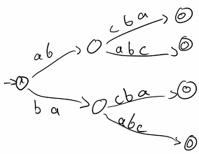

# Indexed exact match algorithms

## Definition

The idea here is to render repeated searching in a huge text more efficient.
Frequent applications include searches (requests) on genomic sequences,
where indexes are built for much faster processing.

There are 3 types of requests, with corresponding methods:
- find W in S once
- find all occurrences of W in S
- find number of occurrences of W in S

## Tries

### Definition

Tree with a root r,
and edges labeled with a character Σ.

	T is a trie = (V,E), Φ: E → Σ,
	where Φ is a labeling function for each E,
	associating a character to an edge.

A word in a trie is a word
read along a path from the root to a leaf.
Words recognized by the trie can be listed with a simple DFS.
Obviously the root is not part of a word.

Nodes are associated by a character via their incoming edge
(rather than the outgoing one).
A leaf node has a single incident edge with the final character.

A simple trie like this only serves to represent a set of words.

### Searching

To find a pattern W in T,
one simple needs to attempt to follow the path
corresponding to successive characters in W
until a leaf with its last character is reached.
Failing that, W ∉ T.

### Complexity

Searching: O(m).
To attain this complexity,
getting the next node in the sequence must be in constant time,
as in with hash tables.
Regardless of the size of the trie,
the complexity will only depend on m.

Constructing and updating the trie is very straightforward.
From a set of words, the trie can be built
either depth-first (word by word)
or breadth-first (by level).

Tries can take a lot of space,
and storing a string is much less expensive
than a path in a graph,
since the path must store extra information
besides the characters themselves.

In other words,
the trie will have as many leaves as there are words,
and both vertices and edges must be stored.
In the worst case, the number of internal edges
is the sum of the word sizes.
The number of edges has a greater effect on space complexity
than the words themselves.

### Applications

Tries are commonly used to represents sets,
as in python.
Unions and intersections are also trivial.

Integer sets can be represented as sequences of (binary) bits.
An integer is transformed to a pattern in binary,
which is then searched for.
Therefore for a 64bit integer,
the search is bound to 64 nodes at most.

### Relationship with finite state automata

A trie can easily be transformed to a DFA,
by considering every node as a state,
the root as the initial state,
leaves as final states,
and labels the transitions between states.

### Prefixes

Given a trie T, we can directly get the prefixes of any word
by reading its path partially.
In other words, every internal node corresponds to a prefix,
with leaves a complete prefix, the entire word.

## Compacted tries

A non-root node of degree = 2 can be compacted
by concatenating it and the next character into a single edge.
In other words, nodes which have only one outgoing possibility
can be joined with the next node.

The idea is the same as compacted de Brujin graphs.

	r → b → a → b → c	r → bab → c
	              ↘ d	        ↘ d

Formally, a compacted trie T(V,E) rooted on r and of degree ≥ 3,
ie. has all internal nodes except r of degree ≥ 3,
ie. they all have one incoming edge, and least two outgoing ones,
and a label function now Φ: E → Σ∗,
ie. not the alphabet but any word ∈ Σ.

### Search

Same as before,
but when traversing the trie,
all characters must be tested in the compacted edges.

### Complexity

Same as before: O(m).

Compacted tries have the obvious advantage
of using less memory by reducing the number of edges,
which is the most costly part of a tree.

We consider that the number of nodes
does not depend on word size.
Here, the number of internal nodes is always ≤ 2n - 1.
The upper bound is much lower and depends solely on the number of words.

## Suffix tree

### Definition

The _suffix trie_ T of suffixes of S
is simply the trie associated to the set of suffixes of S.

The problem here is searching for any occurrence of W in S.
W is a factor of S if and only if W is a prefix of a suffix of S,
ie. W ∈ S if and only if W is "readable" in the suffix trie of S,
starting from the root.

The problem with ordinary suffix tries
and why they are not used in practice
is that they take up too much space.
What is used are *compacted suffix tries*,
and this is what is called a *suffix tree*.

Exact definition:
a suffix tree of S ∈ Σ∗ is the compacted trie of its suffixes,
with every leaf containing the _position of the corresponding suffix_.
There are other equivalent definitions.

### Search strategy

Whether it's a suffix tree or a simple compacted suffix trie,
the first step is adding a terminating character ∉ Σ,
usually _$_.
This is required because the suffix tree is correctly defined
only if no suffix is the prefix of another suffix.

	Without a terminating $:
	abaababaab
	       ---
	  ========
	aab is both a suffix and a prefix to another suffix.
	aab would not be represented as a leaf in the tree,
	which conflicts with the definition of the tree.

	…a→a→b→a→b→a→a→b
	 -----

	Adding a terminating character prohibits this situation.

	…a→a→b→a→b→a→a→b→$
	      ↘ $

Again, W ∈ S if W is readable in the suffix tree,
starting from the root.

	In the example, if we ask aba ∈? S,
	it is in tree, therefore it's true.

In addition to finding prefixes,
the W node's children are all the suffixes in S
for which W is their prefix.
This gives us directly all the positions
of W in S.

	abaababaab$
	===
	     ===--
	   ===----
	3 occurrences of aba.

In other words, if W is readable in the suffix tree,
and path leads to a node v,
the leaves of the subtree T_|v rooted at v
are the occurrences of W in S.

By definition, a tree has at most n-1 edges.
However, being that these (sub)trees
are at least binary and compacted,
the number of edges is at most 2·|leaves|.
This means that the number of edges in the subtree T_|v
is ≤ 2·|leaves|.

### Complexity

For m occurrences of W, at node v,
the number of edges in its subtree is at most 2·|leaves of T_|v|,
giving a total complexity for the search O(n + 2·ocurrences).
2·occurrences is needed to find all occurrences,
and is assumed to be small.

An uncompressed trie would have a maximum of n·(n+1)/2 nodes,
ie. O(n²),
while a suffix tree would have at most n suffixes,
therefore ≤ 2n - 1 nodes (if it's at least binary),
ie. O(n).

It has been proven that given a constructed suffix tree,
there is no better method than suffix trees
for finding a word in a text.

#### Building the suffix tree

Each time a word is added,
it is sufficient to read the word in the tree,
and add it when a dead-end is reached.

In the worst case,
each of the m suffixes must be read,
hence n·(n+1)/2 operations.

Again, quadratic complexity for preprocessing.

#### Ukkonen's algorithm

This algorithm enables the tree to be constructed in linear time.
However it is extremely complex,
both for implementation, and understanding how and why it works.

Today, it is no longer necessary since there are much simpler algorithms,
essentially based on *suffix tables*,
often around O(n·logn) time.

Suffix tables have much lower space complexity,
while preserving similar search complexity.

### Applications

Being that this search's complexity only depends on the size of W,
it is a method applicable in eg. genomics,
and has provided a huge leap in performance in these domains.

### Problems

Quadratic complexity would be prohibiting in bioinformatics,
in addition to the space complexity,
even more prohibiting,
where RAM capacity is the biggest limit.

Often what is important in bioinformatics
is the constant factor multiplying the number of nodes.
Critically, besides the nodes,
edges and the words on each edge must also be stored.
While search complexity is linear,
space might still be prohibiting.
For indexing genomes, this constant must be as low as possible.

Dividing this number by 4 could be the difference
between being able to perform the computations on a personal laptop
and needing access to a cluster
(for instance 20GB vs. 4GB of RAM).

The ideal index is the tree of suffixes.
Other algorithms will attempt to approach its time complexity
while reducing the size of the index.
Ie. we won't get anything better than O(n)
for answering W ∈? S, and similar complexity for finding all occurrences.

## Pat-tree

### Definition

This is a variation of suffix trees,
where edge labels are replaced
by the first character and the size of the word.
This avoids storing large words.
Such a definition would mean that everything else is lost,
and only an gross approximate search would be possible.

S is assumed to be stored as well as the tree.
W can be disregarded quickly if W ∉ S.
If W ∈ S, it must be verified a posteriori,
which can be done by simply comparing
the remaining characters not in the tree,
by using the sizes in the nodes.

Accessing a single character in an array is O(1),
ie. complexity for this is constant
so long as random access is guaranteed.

Pat trees are the first in many other shortcuts.
Other methods store last character,
or multiple characters.

## Suffix links

### Definitions

These essentially augment suffix trees
with additional edges:
we add {u,v} if v is a suffix of u.

### Construction

These edges are easy to find if we already have the tree,
but most suffix tree construction algorithms
add these for free.

### Applications

This idea enables many additional operations
and queries on suffix trees.

One class of operations are for repeats,
such as finding the longest repeat,
repetitions in tandem,
etc.

Another application is the longest common factor
between two texts.
This had allowed the first assembly of a human genome,
ie. given two reads,
finding the longest common subsequences,
or generally given a set of reads,
find repeats,
and enable assembling the reads together.
This avoids comparing each pair of reads,
by constructing the suffix tree for each read,
and finding overlaps rapidly.

In addition, many compaction algorithms
are based on suffix trees.

Other applications include finding frequent words,
or searching for regular expressions
more efficiently that constructing its complete automaton.

It also allows fuzzy searches by allowing gaps
or mismatches,
for instance for aligning words to a genome
(local alignment).
An actual alignment algorithm would normally be necessary,
but it is costly.
We can say here whether there is a alignment in the genome
for which there are at most k mismatches,
speeding up alignment.

## Suffix trie optimization

As we've seen before,
an easy transformation leading to huge benefits
is the transformation of the suffix trie
into a suffix tree.

However, a second possibility exists,
the transformation into a minimal DFA.

## Transformation DAWG

As seen previously,
tries can be transformed directly as a *finite-language minimized DFA*.
In other words, the automaton, like a trie,
will produce a finite set of words,
which means it has no cycles.

Suffix trees correspond to automatons
where transitions are not single characters.
They represent a finite set of words.
Minimization of the automaton is even easier here,
the crucial step is finding equivalent states,
since all states are accessible by definition of the trie.

The minimized automaton corresponding to a suffix trie
is called a *DAWG*
(directed acyclic word graph).
The term is preferred to DFA,
since the automaton is a special simpler case.

Two states are equivalent
if the subtrees rooted at the corresponding node are the same.
We can start from the leaves and traverse to upper levels
to detect them.

	In the example above,
	the states with right language
	corresponding to subtrees b→a are equivalent.
	Same with b→c.
	Here, both subtrees of a previous node in each branch
	have equivalences (ie. c→b→a and c→b→a on both sides).
	In other words the two trees containing these subtrees,
	rooted at the c nodes can also be merged.
	We could find them by starting at the subtree leaves
	and traversing backwards.

The complexity of reading a word in the automaton
is the same as the trie.
Recognizing factors can be done by considering intermediary states.
Suffixes can be found by looking at states starting from final nodes.

## cDAWG: compacted DAWGs

The idea here is to complement the result of one optimization with the other,
since suffix trees can be represented as a DFA and vice versa.

In other words, by minimizing a suffix tree,
or compacting a DAWG,
the result is a common object,
a *cDAWG*
(compacted DAWG).

DAWGs can be compacted by merging states which
with single inward and outward transitions.

	The suffix trie in the example has 17 states.
	Minimizing it leads to a DAWG with 9 states.
	Compacting it leads to suffix tree with 7 states.
	Both lead to a cDAWG with 3 states.

### Complexity

cDAWGs greatly reduce the number of states/edges,
which is very advantageous in terms of space.
Answering W ∈ S is done the exact same way
and has the same O(m) complexity.
Getting suffixes and prefixes
works in an analogous manner to DAWGs,
since we can use final states,
and we can stop at any point during traversal.

There is a guaranteed upper bound on the number of states
(and its reduction).

There is no guarantee of reduction between tries and DAWGs,
which means they can have states in the order of n².

A suffix tree can already be compacted,
in which case there would be no gain,
but compaction from a trie guarantees that each node has a degree ≥ 3.

As a result, cDAWGs may have at most 2n - 1 states,
and 3n - 4 transitions
(like suffix trees, it does not depend on word size),
both being linear as a result.

#### Space

It is proven that this is the data structure
with the smallest space footprint
for a search in O(m) time.

There are links between S's structure and the size of the cDAWG,
determining for instance the minimum compression size.
These include entropy, Kolmogorov complexity, etc.,
ie. the capactity of S to encode information,
and its complexity/genericity.

For instance a sequence of 300 A's in a genome
carries very little information.
The more the cDAWG is large,
the more information S carries,
and the less efficiently can it be compressed.

#### Building

Building still takes linear time in practice,
but there are obvious additional steps compared to a simple suffix tree.

The preferred path is compaction to a suffix tree,
then minimization,
since there are very efficient algorithms for trie compaction,
in O(n) time.

Minimization on the other hand is much less trivial,
and common algorithms are in O(n·logn),
but it can be done in O(n).

In other words,
building can still be in linear time,
but the minimization step is non-negligable,
especially if the suffix tree is already large.

### Applications

Suffix trees are used extremely frequently
and are preferred over cDAWG despite their advantages.

Some operations are more difficult,
such as finding the number of occurrences of W.
This can still be achieved by keeping track
of the numbers of equivalent subtrees in the suffix tree
and adding them recursively.

The most problematic is finding all occurrences of W in S.
This data structure loses position information
when subtrees are merged.
Subtrees may be equivalent
but they carry this additional information in the tree's topology.

Should we augment the cDAWG with this information,
we'll simply arrive at the same space complexity as a suffix tree.

There are still many applications for the structure,
such as testing if a sequence belongs to a certain species,
something very common in metagenomics.
DAWGs are a generalized data structure not specific to suffixes.

### Summary: comparison of cDAWG vs. suffix trees

Suffix trees:

	+ number of requests
	+ positions of occurrences
	- memory footprint

cDAWG:

	+ memory footprint
	- no number or position of occurrences (requests)
	- larger build time
	- no suffix links, and other possible operations

## Searches on multiple texts

Here the problem is formalized as follows:

	Let {S₁,…,S₏} be a set of texts,
	and W a word that will be searched for in each.
	∃? i≤n such that P ∈ Sᵢ?

All of the algorithms seen previously are generalizable to this problem.

Typically, the set of texts will just be concatenated together
into a single one.
The problem there is overlaps between texts
which can produce artificial occurrences.

A possible solution is to interpose a terminating character _$_
between each as before.
Sometimes, Σ can even be augmented with differents ones for each sequence,
eg. {$₁,…,$₂}.
This is the common solution for general suffix trees
(ie. suffix trees for any number of sequences).

An example is a suffix tree of all genomic reads.
Genomes themselves are composed of multiple contigs,
chromosomes, etc.
and can be indexed in the same way.
In practice, we don't need to concatenate all the reads,
we can simply process them one by one,
adding a unique terminating character at the end of each one.

## Suffix tables

This is an important data structure still in frequent use today.

### Definition

The idea here is to conserve all or almost all the properties of suffix trees,
but with a much lower memory footprint.

A suffix table is an integer list
of the positions of the suffixes,
suffixes being ordered alphabetically.
It is assumed that the terminating character
comes before the rest of Σ.

	S = a  a  b  a  c  a  a  b  a  c  $
	    ₁  ₂  ₃  ₄  ₅  ₆  ₇  ₈  ₉ ₁₀ ₁₁

	Suffixes in alphabetical order:

	i	SA
	-----------------
	1	11	$
	2	6	aabac$
	3	1	aabacaabac$
	4	7	abac$
	5	2	abacaabac$
	6	9	ac$
	7	4	acaabac$
	8	8	bac$
	9	3	bacaabac$
	10	10	c$
	11	5	caabac$

	SA = {11, 6, 1, 7, 2, 9, 4, 8, 3, 10, 5}

SA is the table SA,
where SA[i] is the position of the ith suffix
in alphabetical order.
The only thing kept in memory will be SA.

We reuse the property that a pattern W
is a factor of S if it's the prefix of a suffix.

The first remarkable property here
is that any pattern in S always appears in an interval in SA.
Therefore when searching for W,
we look for which suffixes W is a prefix to.

	a ∈ SA[2,7] (1-indexed)
	ac ∈ SA[6,7]

Since suffixes were ordered alphabetically,
the set of suffixes of a prefix must necessarily be consecutive.

To determine if a word W is contained in S,
we find its interval in SA,
which will be 0 if it isn't.
Since SA is ordered, we can simply use binary search,
this time one for the lower bound, and one for the upper bound.

	W = bac
	We need the interval in SA with b as a prefix.
	First b is looked for in SA, starting from the middle.
	The next character in alphabetical order is c.
	We then search for c from the middle table now starting at c.

	b ∈ SA[8,9]

To then extract the suffixes corresponding the this interval,
we can simply access the positions SA[i..n] in S,
which correspond to the suffixes SA was built from.
Knowing S and SA, no information is lost.

	SA[8] = 8	bac
	SA[9] = 3	bacaabac
	These indices directly correspond to the ones in the table above.

### Interval bounds algorithms

#### Left bound

The left bound is the smallest suffix for which W is a prefix,
wrt alphabetical order, not word size.

	l ← 1
	r ← n
	while l < r			// l and r are iteratively moved until they are equal
		mid ← ⌊(l+1)/2⌋		// floor
		if P > S[SA[mid]..n]
			l ← mid + 1
		else
			r ← mid
	return l

#### Right bound

Biggest suffix for which W is a prefix.

	l ← 1
	r ← n
	while l < r
		mid ← ⌊(l+1)/2⌋		// floor
		if P > S[SA[mid]..n]
			l ← mid
		else
			r ← mid - 1
	return r

### Complexity

Either of the interval bounds: O(m·logn).
m comparisons of W at each position,
for each logn steps.
Obviously, this is higher than the O(n) of the suffix tree,
but it is expected.
This can even be improved.
